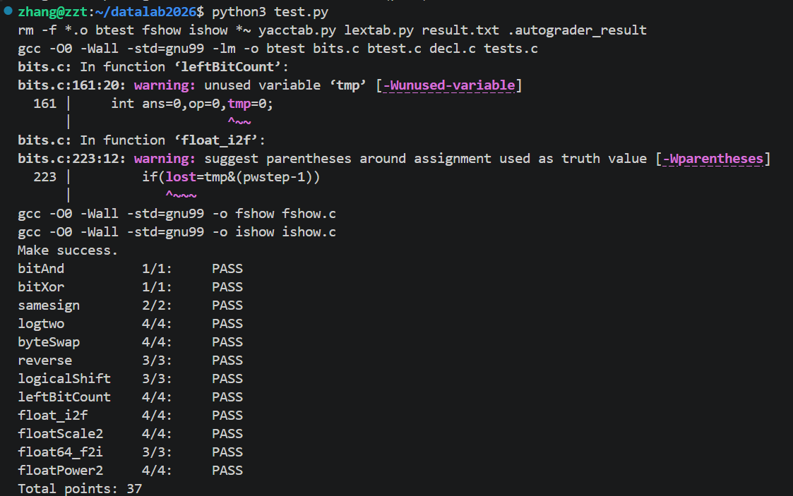

# datalab 报告

姓名：张梓桐

学号：2025201885

| 总分    | bitAnd | bitXor | samesign | logtwo | byteSwap | reverse |
| ----- | ------ | ------ | -------- | ------ | -------- | ------- |
| 37.00 | 1.00   | 1.00   | 2.00     | 4.00   | 4.00     | 3.00    |

| logicalShieft | leftBitCount | float_i2f | float_Scale2 | float64_f2i | floatPower2 |
| ------------- | ------------ | --------- | ------------ | ----------- | ----------- |
| 3.00          | 4.00         | 4.00      | 4.00         | 3.00        | 4.00        |

test 截图：



<!-- TODO: 用一个通过的截图，本地图片，放到 imgs 文件夹下，不要用这个 github，pandoc 解析可能有问题 -->

## 解题报告

### 亮点

<!-- 告诉助教哪些函数是你实现得最优秀的，比如你可以排序。不需要展开，展开请放到后文中。 -->

1. reverse
2. logtwo

### reverse

```c
unsigned reverse(unsigned v) {
    unsigned x=v;
    x=((x&0x55555555)<<1)|((x>>1)&0x55555555);
    x=((x&0x33333333)<<2)|((x>>2)&0x33333333);
    x=((x&0x0f0f0f0f)<<4)|((x>>4)&0x0f0f0f0f);
    x=((x&0x00ff00ff)<<8)|((x>>8)&0x00ff00ff);
    x=((x&0x0000ffff)<<16)|((x>>16)&0x0000ffff);
    return x;
}
```

假设 $v=v_{31}v_{30}\cdots v_0$，将 $v$ 按照如下方式反转：

* 将 $v$ 相邻的 $2$ 个二进制位交换；（$31$ 和 $30$ 交换，$29$ 和 $28$ 交换……）
* 将 $v$ 每 $2$ 个位分为一组，相邻的两个组交换；（$(31,30)$ 和 $(29,28)$ 交换，$(27,26)$ 和 $(25,24)$ 交换……）
* 将 $v$ 每 $4$ 个位分为一组，相邻的两个组交换；
* ……
* 将 $v$ 每 $16$ 个位分为一组，相邻的两个组交换。

不难发现，在经历上述过程之后，$v$ 实现了翻转。

### logtwo

```c
int logtwo(int v) {
    int op,x=v,now=0,tmp;

    op=(x>>16)>0;
    tmp=op<<4;
    x=x>>tmp;
    now=now|tmp;

    op=(x>>8)>0;
    tmp=op<<3;
    x=x>>tmp;
    now=now|tmp;

    op=(x>>4)>0;
    tmp=op<<2;
    x=x>>tmp;
    now=now|tmp;

    op=(x>>2)>0;
    tmp=op<<1;
    x=x>>tmp;
    now=now|tmp;

    op=(x>>1)>0;
    tmp=op;
    x=x>>tmp;
    now=now|tmp;

    return now;
}
```

题目等价于找到最高位的 $1$。

考虑类似于分治的做法：

* 如果前 $16$ 位中存在 $1$，则只考虑前 $16$ 位，否则只考虑后 $16$ 位；
* 在当前的 $16$ 位串中，如果前 $8$ 位存在 $1$，则只考虑前 $8$ 位，否则考虑后 $8$ 位；
* ……
* 在当前的 $2$ 位串中，如果前 $1$ 位存在 $1$，则只考虑前 $1$ 位，否则考虑后 $1$ 位；

这样只需要查找的级别就从 $\mathcal O(n)$ 变成了 $\mathcal O(\log n)$

分支（向左边走还是向右边走）可以用 `<` 来实现。

## 反馈/收获/感悟/总结

反馈：`float_i2f` 的符号限制过于严格，我花了很长时间把 $32$ 个符号优化成 $30$ 个符号。

<!-- 这一节，你可以简单描述你在这个 lab 上花费的时间/你认为的难度/你认为不合理的地方/你认为有趣的地方 -->

<!-- 或者是收获/感悟/总结 -->

<!-- 200 字以内，可以不写 -->

## 参考的重要资料

<!-- 有哪些文章/论文/PPT/课本对你的实现有重要启发或者帮助，或者是你直接引用了某个方法 -->

<!-- 请附上文章标题和可访问的网页路径 -->

通过课本学习 float 编码。